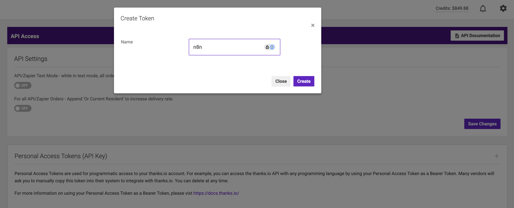
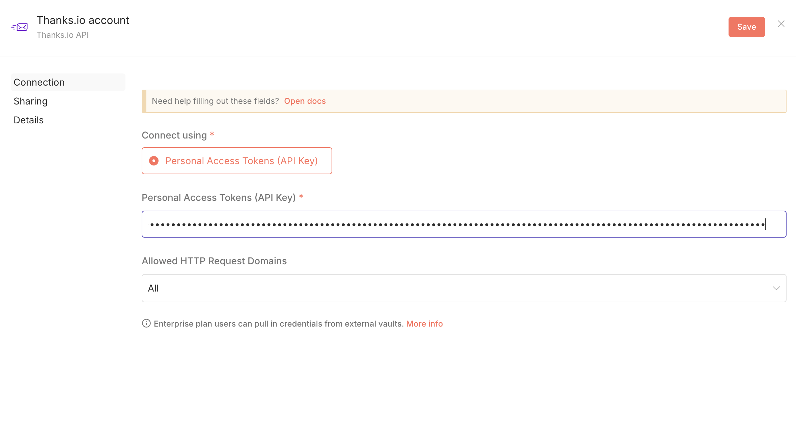
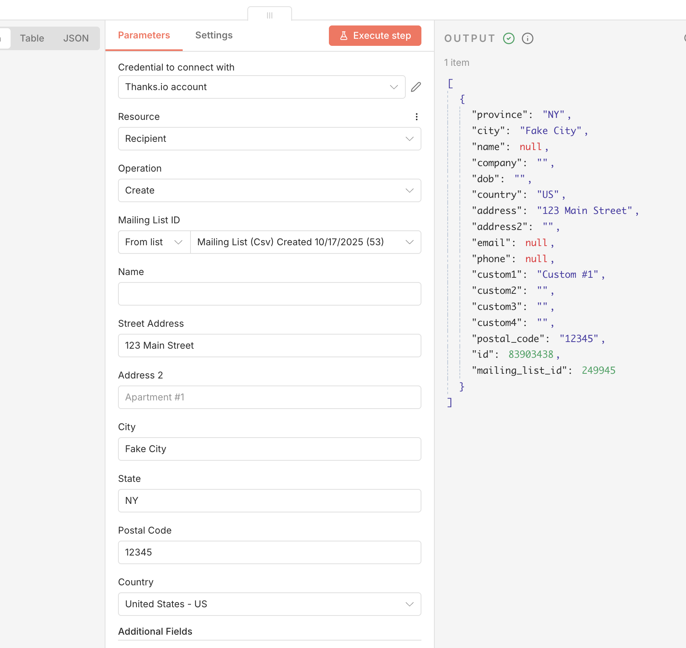

# n8n-nodes-thanks-io

This repository contains the official thanks.io community node for n8n.

[thanks.io](https://www.thanks.io) provides everything you need for direct mail success, including AI-realistic handwritten postcards, letters, and notecards; QR tracking; delivery notifications; and powerful automation— all at super competitive pricing.

## Installation

Follow the [installation guide](https://docs.n8n.io/integrations/community-nodes/installation/) in the n8n community nodes documentation.

## Credentials

You must have a thanks.io API key to use this node. You can register for a free account and obtain an API key here:

- https://www.thanks.io

Once registered, generate a Personal Access Token in thanks.io:

- Dashboard → Settings → API Access  
  https://dashboard.thanks.io/profile/api

Then in n8n, create a credential named **“Thanks.io API”** and paste in your token.

## Operations / Usage

### Add Recipient to Existing Mailing List 
  Easily add recipients to a mailing list and trigger thanks.io’s campaign automation. Campaigns can be created and edited in the [thanks.io Dashboard](https://dashboard.thanks.io/).

## Compatibility

Tested against n8n version **2.2.1**

## Resources

- [n8n community nodes documentation](https://docs.n8n.io/integrations/#community-nodes)
- [thanks.io technical documentation](https://docs.thanks.io)
- [thanks.io product documentation](https://help.thanks.io)

## License

[MIT](https://github.com/thanks-io/n8n-nodes-thanks-io/blob/main/LICENSE.md)
