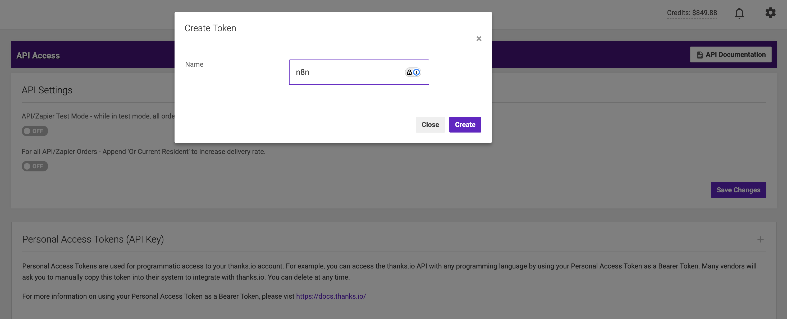
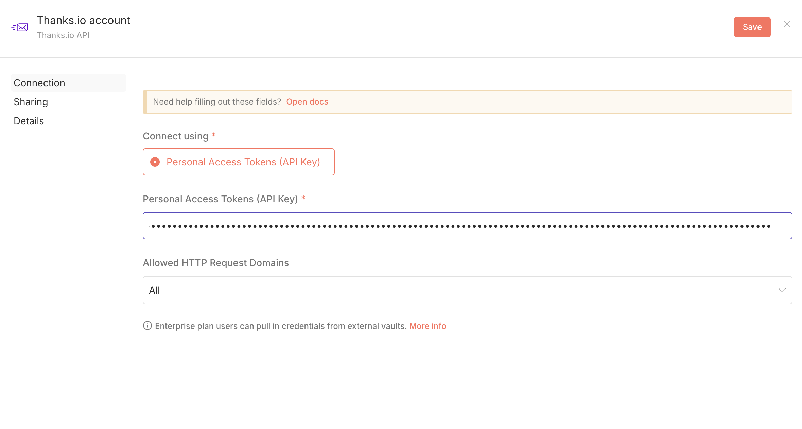
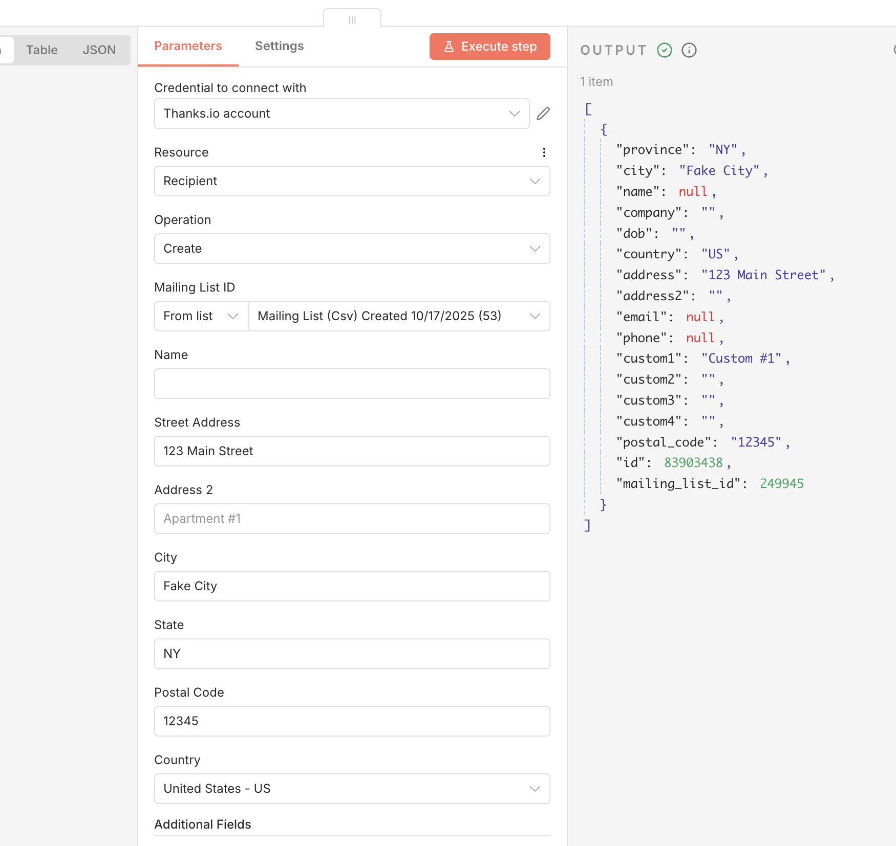

# n8n-nodes-thanks-io

This repository contains the official thanks.io community node for n8n.

[thanks.io](https://www.thanks.io) provides everything you need for direct mail success, including AI-realistic handwritten postcards, letters, and notecards; QR tracking; delivery notifications; and powerful automation— all at super competitive pricing.

## Installation

Follow the [installation guide](https://docs.n8n.io/integrations/community-nodes/installation/) in the n8n community nodes documentation.

## Credentials

You must have a thanks.io API key to use this node. You can register for a free account and obtain an API key here:

- https://www.thanks.io

Once registered, generate a Personal Access Token in thanks.io:

- Dashboard → Settings → API Access  
  https://dashboard.thanks.io/profile/api

Then in n8n, create a credential named **“Thanks.io API”** and paste in your token.

## Test Mode

thanks.io has a built-in **API Testing Mode** that accepts orders normally but automatically cancels them instead of sending real mail. Use it while building and validating your n8n workflow.

**What it does:**
- Accepts your API requests and validates your payloads
- Automatically cancels orders so no mail is physically sent
- Prevents accidental production sends during development

**When to go live:** Keep testing mode enabled until you have verified authentication is working, recipient payloads are correct, and creative/message fields render as expected. Then disable it to send real mail.

**How to enable/disable:** Visit [Dashboard → Settings → API Access](https://dashboard.thanks.io/profile/api) and toggle **API/Zapier Test Mode**.

> **Note:** If testing mode is off, you have a one-hour window to cancel an order manually before it moves further into fulfillment.

## Operations / Usage

This node exposes two resources: **Mailer** and **Recipient**.

---

### Mailer

Send physical mail pieces to recipients. All mailer operations share common fields for audience selection, creative content, and delivery options.

#### Common fields (all mailer operations)

| Field | Description |
|---|---|
| **Audience** | How recipients are targeted: *Mailing Lists*, *Recipients* (inline), or *Radius Search* (buy a nearby list) |
| **Image Template ID** | ID of a saved image template for the front/background. Use `0` to omit. |
| **Front Image URL** | Public URL to a front image (JPEG/PNG). Required if no Image Template ID is set. |
| **Message** | Handwritten message text. Supports personalization tokens like `%FIRST_NAME%`. |
| **Message Template ID** | ID of a saved message template. Use `0` to omit. |

**Additional Fields** (optional, all operations):

| Field | Description |
|---|---|
| Handwriting Style ID | ID of a handwriting font to use |
| Handwriting Color | Preset name (`blue`, `black`, `green`, `purple`, `red`) or hex (`#4287f5`) |
| Handwriting Realism | Enable AI realism effect on supported fonts |
| Return Name / Address | Custom return address printed on the envelope |
| Send Standard Mail | Use Standard postage instead of First Class |
| Notification Emails | Comma-separated emails to notify on order events |
| Preview | Return a preview without sending the mail piece |
| Sub-Account ID | Route the order through a thanks.io sub-account |

#### Audience types

- **Mailing Lists** — Select one or more existing lists from the thanks.io dashboard.
- **Recipients** — Provide recipient addresses directly in the node (Name, Address, City, State, Postal Code, Country, plus optional Email, Phone, DOB, Custom 1–4).
- **Radius Search** — Purchase a list of addresses near a given address. Configure record count (1–10 000), record types (All, New Homeowner, Renters, etc.), and optional filters like condos and append data.

---

#### Send Postcard

Send a 4×6, 6×9, or 6×11 postcard.

| Field | Description |
|---|---|
| **Size** | `4x6`, `6x9`, or `6x11` |
| **QR Code URL** | Auto-generates a scannable QR code printed on the mailer |
| Use Custom Background | Replace the default background with a custom image |
| Custom Background Image URL | URL to the custom background image |

---

#### Send Notecard

Send a folded notecard (greeting card style).

| Field | Description |
|---|---|
| **QR Code URL** | Auto-generates a QR code on the interior |
| Use Custom Background | Replace the default background |
| Custom Background Image URL | URL to the custom background image |

---

#### Send Windowed Letter

Send a letter in a windowed envelope (recipient address shows through window).

| Field | Description |
|---|---|
| **QR Code URL** | Auto-generates a QR code on the letter |
| Additional Pages URL | URL to extra pages to include after the cover letter |
| PDF Only URL | URL to a PDF that replaces the entire letter (no cover letter generated) |

---

#### Send Windowless Letter

Send a letter in a standard windowless envelope.

| Field | Description |
|---|---|
| **QR Code URL** | Auto-generates a QR code on the letter |
| Additional Pages URL | URL to extra pages to include |
| PDF Only URL | URL to a PDF that replaces the entire letter |

---

#### Send Magnacard

Send a magnet-style direct mail piece.

| Field | Description |
|---|---|
| Use Custom Background | Replace the default background |
| Custom Background Image URL | URL to the custom background image |

---

#### Send Giftcard

Send a physical gift card mailer bundled with a digital gift card.

| Field | Description |
|---|---|
| **Giftcard Brand** | Brand of the gift card (e.g. Amazon, Visa). Select from the list or enter a brand code. |
| **Giftcard Amount** | Face value of the gift card. Available amounts depend on the selected brand. |

---

### Recipient

#### Add Recipient to Existing Mailing List

Adds a contact to a mailing list and triggers any thanks.io campaign automation attached to that list. Campaigns can be created and edited in the [thanks.io Dashboard](https://dashboard.thanks.io/).

| Field | Description |
|---|---|
| **Mailing List ID** | Select a list or enter its numeric ID |
| **Name** | Recipient full name |
| **Street Address** | Street address (or full address on one line) |
| Address 2 | Apartment, suite, unit, etc. |
| **City** | City |
| **State** | State or province |
| **Postal Code** | ZIP or postal code |
| **Country** | Country |
| Additional Fields | Company, Email, Phone, DOB, Custom 1–4 |

## Compatibility

Tested against n8n version **2.2.1**

## Resources

- [n8n community nodes documentation](https://docs.n8n.io/integrations/#community-nodes)
- [thanks.io technical documentation](https://docs.thanks.io)
- [thanks.io product documentation](https://help.thanks.io)

## License

[MIT](https://github.com/thanks-io/n8n-nodes-thanks-io/blob/main/LICENSE.md)
